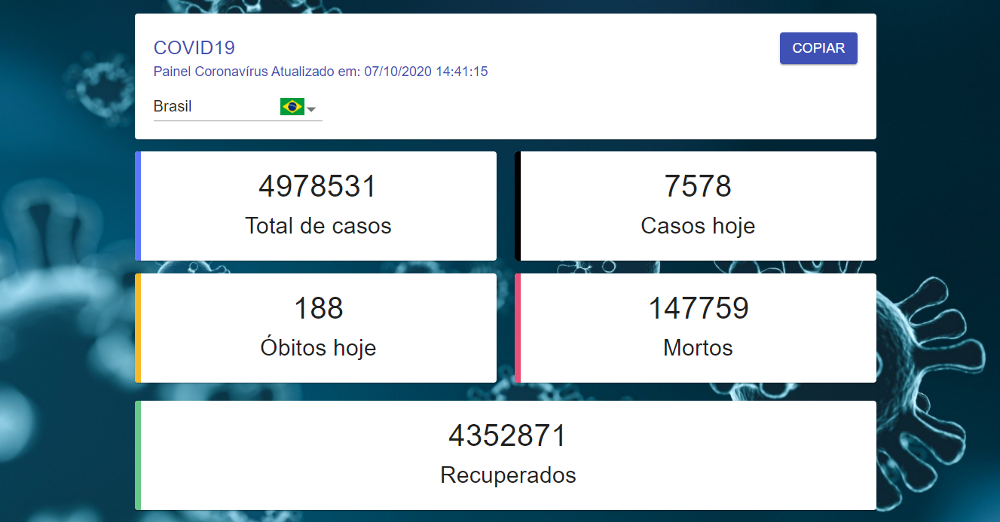

# covid19-dio

Desenvolvendo uma Progressive Web Application com React para mapear os dados do COVID19 pelo mundo.

Realizado no curso de React na Digital Innovation One

# Créditos

Bruno Carneiro

